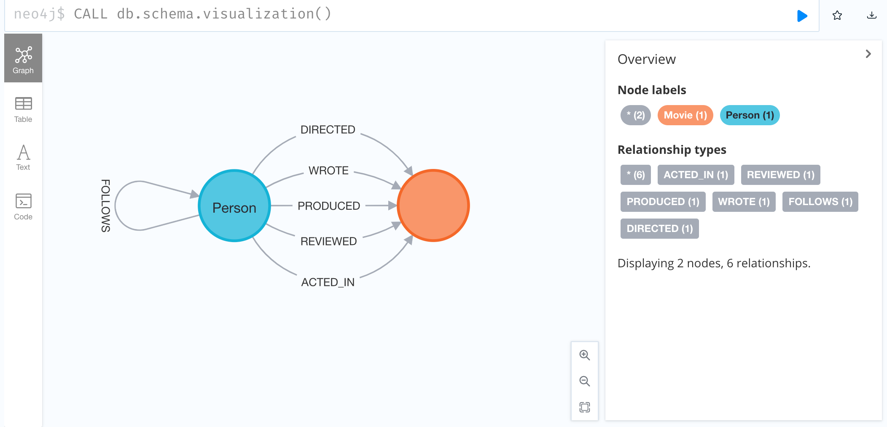

# Preparation for the Neo4j certification


A directed relationship is non-symmetrical. It goes from a source node to a target node. 
This type of relationship may contain additional qualifying properties, for example a 
weighting or strength indicator.

An undirected relationship is symmetric with no directional character, it is simply between 
two nodes instead of having a source and target.

Every relationship in the neo4j database is directed by design. ]

```
CALL db.schema.visualization()
```

